<p align="center">
  
</p>

<p align="center">
  An agentic harness with a dashboard for a face: Rime, leylines, wards. And a standalone desktop development environment.
  <br>
  <a href="https://github.com/frostdev-ops/rimeward/releases/latest">Published desktop installers</a> · macOS (Apple silicon / Intel) · Windows · Linux
</p>

Rimeward is an agentic harness in the shape of a personal dashboard. **Rime**, the built-in
agent, has real tools over everything on the board. **Leylines** wire what happens in one ward
to what another one does. Every **ward**, from the inbox to a real browser, is one thing to
watch or one thing to do. All of it is yours to shape: what runs, how it looks, and what the
agent may do on its own.

## Screens

<p align="center">
  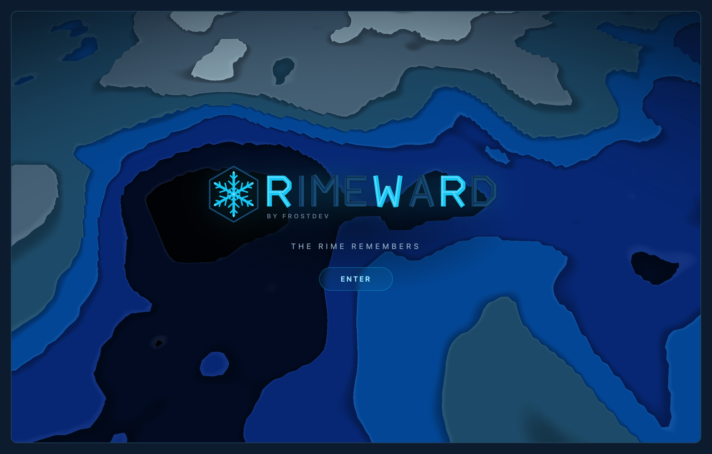
</p>
<p align="center">
  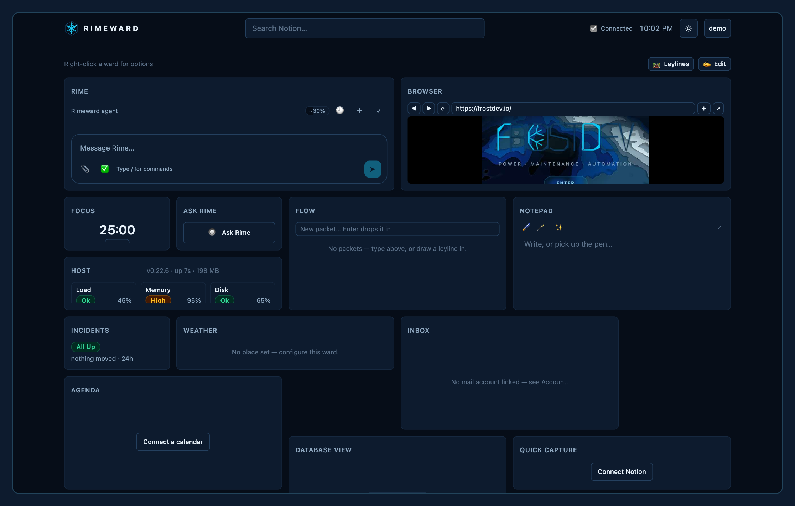
</p>

## What it does

- **An agent with the run of the place.** Rime reads and edits the same wards you do: the
  layout, the theme, the leylines, service status, weather, mail, calendar, Notion, timers,
  packets, a bash sandbox, the web, and a browser you both drive. It keeps its memory and skills
  as wards, speaks to MCP servers, wakes on a schedule or on a message, and asks before anything
  leaves the building. Several Rime wards can run side by side, each with its own model,
  approvals and caps. The chat context meter uses live model limits from Codex/OpenRouter,
  includes instructions and tools, and labels estimated usage and cached or unavailable capacity.
- **Leylines, the automations.** A routine finishing, a button pressed, a service going down,
  mail arriving, a chat message, the weather turning, a time of day; then a timer starts, a
  Notion task is checked, a message is sent, a packet moves, Rime is asked. Conditions,
  templates and fan-out, drawn on a canvas across every page.
- **Wards for what you already use.** Service status for your own servers (http, tcp, pm2,
  docker, systemd) with history, incidents and charts; one inbox over Gmail, Outlook, Zoho and
  IMAP; a merged agenda over Google, Outlook, iCloud and a Notion database; Notion databases
  and pages as tables, lists, calendars and capture lines; chat wards for Discord, Telegram,
  Slack, Twilio, Matrix, Teams and push; routine timers, launchers, buttons and flows; a notepad
  with ink, whose handwriting Rime transcribes.
- **Make it yours.** Per-user themes with presets, accent and glass; 43 typefaces; six icon
  sets; eighteen animated shader backgrounds or your own photo, and a header banner that runs
  the same scenes; pages, containers and a Configure dialog on every ward. The splash, the
  name and the brand art belong to the instance, not the repo.
- **Develop on your desktop, pick up on your phone.** Open a local project into an editor
  with a left-hand file explorer, tabs, search/replace, recovery diffs, and bundled Biome
  linting and formatting. Real terminals run your shell, Codex, or Claude Code; Rime can
  coordinate their assignments and Git worktrees. A paired server relays the same live
  desktop environment through one dashboard. Pages, settings, icons, backgrounds, branding,
  and Rime stay in sync; the app routes work automatically. Project folders stay on their
  computer, and its tools become unavailable remotely while that computer is offline.

## The words

Rimeward has its own vocabulary, and the code follows it.

**Rimeward** is the dashboard behind the login and the desktop app; the splash in front of it
says whatever your instance's site settings say. Rime is the frost that grows on the windward
side of things; Rimeward is where you keep watch.

A **ward** is one card on the dashboard. Every ward is one thing to watch or one thing to do: the
weather, an inbox, a Notion database, a routine timer, a real browser. Wards come from a catalog,
grouped by what they are for: *At a glance*, *Mail*, *Chat & messaging*, *Notion*, *Write &
capture*, *Leylines & automation*, *Rime* (including development wards), and *Layout & looks*. Wards live on **pages**, the tabs
across the top; a **container** groups wards; a **spacer** is breathing room.

<p align="center">
  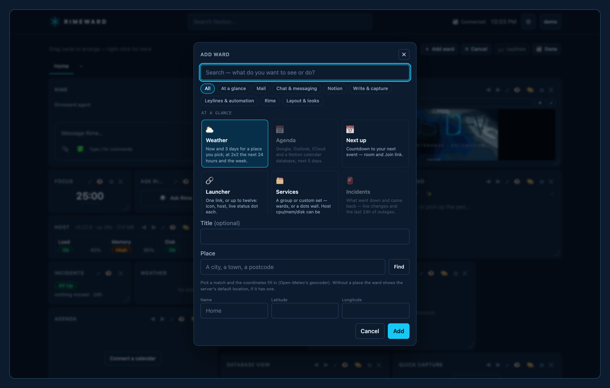
</p>

A **leyline** is a wire from something that happens in one ward to something another ward does:
a routine finishing, a button being pressed, a service going down, mail arriving, a message in a
chat, the weather turning; then a timer starts, a Notion task is checked, a message is sent, a
flow packet moves, Rime is asked. A leyline can carry conditions, and every leyline is one
trigger, one action; fan-out is more leylines. **Leylines mode** is where you draw them, across
every page at once.

<p align="center">
  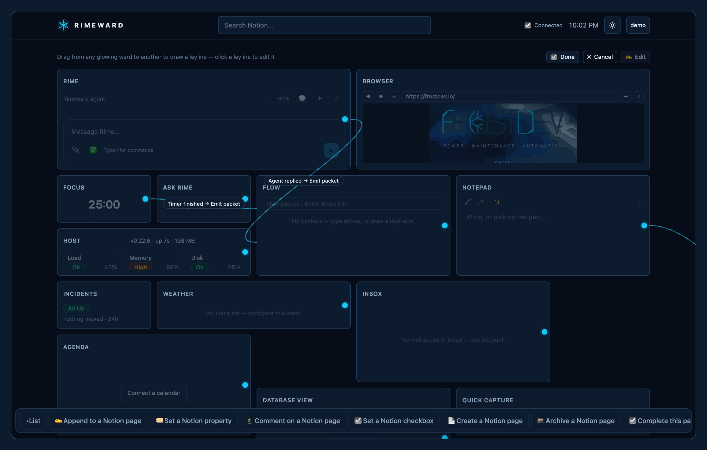
</p>

**Rime** is the agent that lives in the dashboard. It reads the same wards you do, keeps its own
memory and skills as wards, drives the same browser you drive, and asks before anything leaves
the building: mail, chat, and the rest of the outbound tools wait for a confirm. A **routine** is
a timer with rounds. A **packet** is what moves between flow wards. The **home route** is the
desktop app's tunnel: a browser ward on the server egressing from your own connection, or running
its Chromium on your machine entirely. It remains compatible with earlier clients. One shared dashboard brings pages, appearance, and Rime together without a server/local selector. Execution placement and connection recovery are handled by the app. A **project** is an approved local folder referenced by a page's
development wards.

<p align="center">
  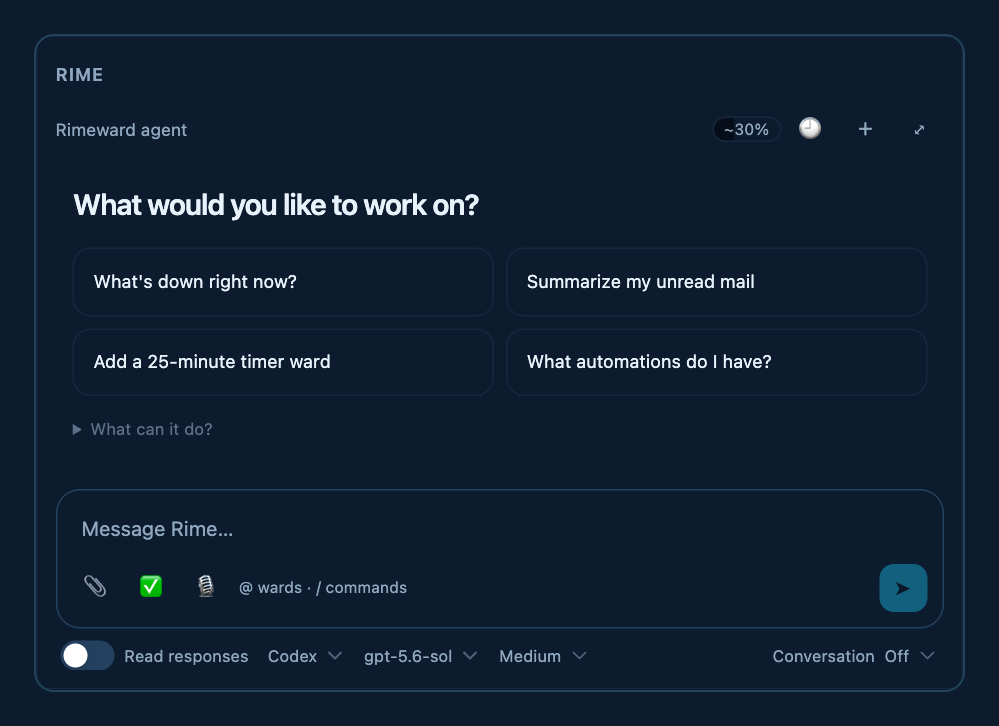
  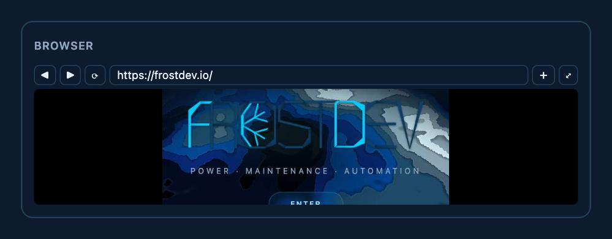
</p>

In the code the words keep their engineering names where they were there first: a ward is a
`WardInstance` from the `CATALOG` in `src/lib/wards.ts`; leylines are logic edges in
`src/lib/logic*.ts` (triggers, conditions, actions, the `.wiring` mode); Rime is `src/lib/agent/`.
User-facing copy always says ward, leyline, Rime.

## Stack

Astro 7 (SSR, Node adapter) · TypeScript · Tailwind 4 · SQLite (`better-sqlite3`) · three.js
for the splash · Playwright for the browser wards · Tauri 2 (Rust) for the desktop app ·
CodeMirror 6 + Biome for editing · xterm.js + node-pty for terminals.
Node 22.18 or newer.

## Run it

```sh
npm install
cp .env.example .env            # PUBLIC_BASE_URL and TOKEN_ENC_KEY are required
node bin/rimeward.mjs users create you@example.com --admin   # prints the password once
npm run dev:env                 # http://localhost:4321 (.env loaded)
npm test                        # node --test
npm run build && npm run preview
```

`node bin/rimeward.mjs doctor` lists what is still missing. The CLI also manages users,
settings, the splash, the brand files, and backups (`--help`).

## Configure

Everything an instance is comes from `.env`, the settings table, and the data directory. The
repo carries nothing of yours.

| Variable | What it is |
|---|---|
| `PUBLIC_BASE_URL` | The URL people reach the site on. Redirect URIs, the CSRF check and the Secure cookie flag derive from it. |
| `PORT`, `HOST` | `3005` and `127.0.0.1` behind a reverse proxy; `0.0.0.0` in a container. |
| `HOMEPAGE_DATA_DIR` | The database, uploads, browser profiles and the agent's files. Default `./data`. |
| `TOKEN_ENC_KEY` | 32 bytes base64. Seals every stored credential; part of every backup. |
| `GOOGLE_CLIENT_ID/SECRET` | Google sign-in and the Gmail / Calendar links. |
| `SSO_WORKSPACE_DOMAIN` | A Google Workspace domain that may sign in without an invite (its first user becomes admin). Unset: invited addresses only. |
| `MS_CLIENT_ID/SECRET`, `MS_TENANT_ID` | Outlook and Teams. The tenant defaults to `common`. |
| `NOTION_CLIENT_ID/SECRET`, `ZOHO_CLIENT_ID/SECRET` | Notion pages and databases; Zoho Mail. |
| `BROWSER_EXECUTABLE`, `BROWSER_PROFILES` | A Chromium (or a wrapper that drops root) and where its profiles live. Unset: playwright-core's own, under the data dir. |
| `PM2_BIN`, `DOCKER_BIN`, `SYSTEMCTL_BIN` | The tools behind pm2 / docker / systemd monitor targets when PATH does not carry them. |
| `PUBLIC_APP_BUILD` | The build stamp on the dashboard. Default: the package version. |
| `TZ` | Set in the process manager, not `.env`: the logic engine's clocks and due dates run in it. |

**Site and brand.** The name, tagline, splash cards and footer are settings, edited on the
admin page or with `node bin/rimeward.mjs splash`. The wordmark, emblem, header mark and icons
are files in `data/brand/` (`brand install <slot> <file>` normalises them); without one the
Rimeward crystal serves.

**Monitoring.** The monitors the Services wards watch are a registry in the database, edited by an
admin at `/admin/monitors` (or `node bin/rimeward.mjs monitors add|remove|import`): `http` and `tcp`
probes, and the pm2 processes, docker containers and systemd units of the machine the app runs on —
it sees no other machine. A Services ward shows a group, a hand-picked set, or everything.

**Browser wards** drive playwright-core's Chromium (`npx playwright-core install chromium`). Run
the server as a non-root user, or point `BROWSER_EXECUTABLE` at a wrapper that drops root; as
root without one, Chromium runs without its sandbox. Every host a user names is checked against
the private address ranges before it is dialled, the Docker bridge range included — reach a
sibling container by its public name or with host networking.

## Deploy

`server.mjs` is the production entry: Astro's standalone server plus the websocket upgrade the
desktop app needs. Run it under a process manager with `.env` loaded
(`node --env-file=.env server.mjs`, `TZ` set there too) behind a reverse proxy that does not
buffer live event streams and passes `Upgrade` on `/api/tunnel` and `/api/devices/connect`.
`ops/nginx.example.conf` includes `ops/runtime-relay.nginx.conf`: install that file at the
path named by the include. `/runtime/` must have request/response buffering, disk spill,
caching, and payload logging disabled at the origin and edge. The application adds
`Cache-Control: no-store`; review CDN overrides before enabling remote access. See the
[deployment and verification steps](docs/development-workspaces.md#server-configuration-required-for-remote-access).

Give the process ten seconds to stop: browser wards
close Chromium gracefully so a fresh login's cookies are not lost.

**Docker.** `compose.yaml` builds the image, keeps the data directory in a volume, and runs
Chromium with the seccomp profile that lets it keep its sandbox as a non-root user.

```sh
cp .env.example .env            # HOST is set by the image; PUBLIC_BASE_URL is yours
docker compose up -d --build
docker compose exec app node bin/rimeward.mjs users create you@example.com --admin
```

**Back up** the whole data directory and `TOKEN_ENC_KEY`: `node bin/rimeward.mjs backup <dir>`
takes an online copy of the database and the files beside it. The database alone restores to an
agent with no memory and tokens nobody can decrypt.

**Limits, on purpose.** Per user and hour: 10 mails, 30 button presses, 60 one-shot model
calls, 60 chat messages (20 SMS), and each Rime ward's own cap on unattended turns. One server
timezone. The login throttle keys on the address the server sees, which behind a proxy is the
proxy's — stricter than trusting a forwarded header without a trusted-proxy list.

## Desktop app

`desktop/` is a standalone Tauri 2 installation of the same backend and Rimeward harness. It bundles Node and Chromium, owns its projects and recovery data locally, and provides modular project, editor, terminal, and Git wards. Browser and phone clients remotely control a paired desktop through an independently usable server. Project folders are never replicated to that server.

```sh
npm ci  # includes the pinned Tauri CLI
npm run desktop:dev
npm run desktop:build
```

One shared dashboard brings server pages and desktop projects together. The app routes each ward automatically, without a local/server selector; phones control the same live editors and terminals through the server. Returning restores the last page. Project files stay on their original computer.

**Rime follows you.** The first connected server supplies Rime's default persona/model and provider access. Rime's own files, memories, skills, attachments, and chat history sync to a local copy. Offline edits reconcile on reconnect; conflicting local versions remain in **Chat history → Recovered version**. Model credentials stay on the server: an offline desktop needs its own configured provider to make new model calls. Chat history and its code/tool excerpts are shared Rime data; project folders, terminal processes, and pending actions are not replicated.

Terminal sessions use keyboard-accessible tabs with visible close buttons, without resizing the ward. Closing a tab keeps its process running; reopen it from the terminal menu. Rime can page through project searches, directories, and Git changes, and retain task reviews with file hashes and reported check results. Long model waits show elapsed time and relay activity; failures include a reference for metadata-only diagnostics.

Rime can make targeted disk edits with [apply_patch](docs/apply-patch.md), including add, update, move, and delete operations. Confirmations expose the full patch; preflight checks protect dirty or human-owned buffers, and recovery copies precede destructive writes. Cancelled or signal-terminated commands carry explicit termination metadata and a null exit code.

**Keep working while a task runs.** Press **Ctrl+B** in chat, or use **Run in background**, to release Rime from a running shell command, terminal wait, or peer-agent request. **Tasks** (also `/tasks`) shows progress, native command output, results, and Stop controls. Rime can start these tools with `background:true`; desktop `terminal_exec` runs project builds, tests, and development servers under the ward's approval policy. Completion notices arrive without an extra model call. Task records survive reloads; a runtime restart marks unfinished tasks interrupted and never replays commands.

Pair servers in **Connections** after launch. See [development workspace setup and validation](docs/development-workspaces.md), including the required proxy privacy configuration. The desktop release workflow builds separately for Apple silicon, Intel macOS, Windows, and Linux on a `desktop-v*` tag: macOS DMGs, Windows installers, and Linux DEB/AppImage packages. Signing uses the Apple secrets listed in that workflow; publication waits for every platform to pass.

First launch offers **Bring your dashboard** or **Start right here**. To connect, enter your
server address and approve the desktop in your normal browser; the remote dashboard is
still there. **Open project** reuses an existing project page or creates Editor and Rime
side by side, with Terminal and Changes below. Rime inherits the page's project context.
There is no separate development page type. Integrations and CLI
credentials remain independent on each installation; connecting does not copy them.

<p align="center">
  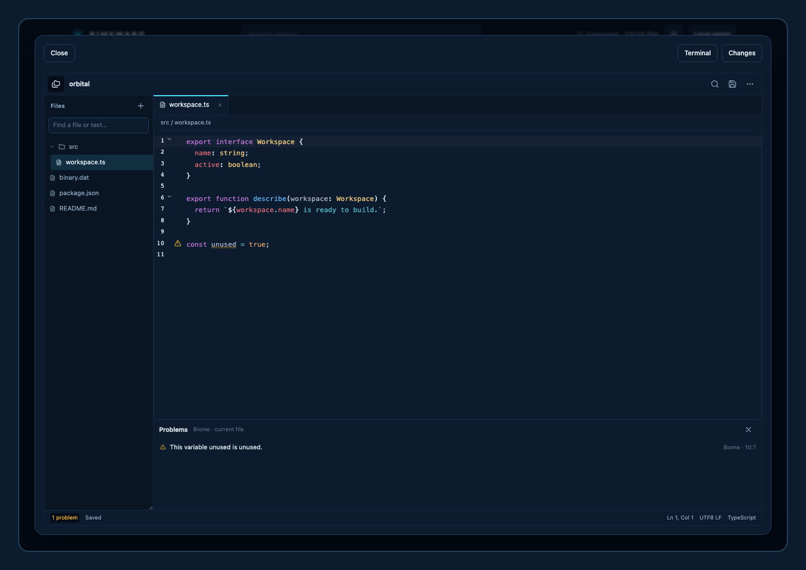
  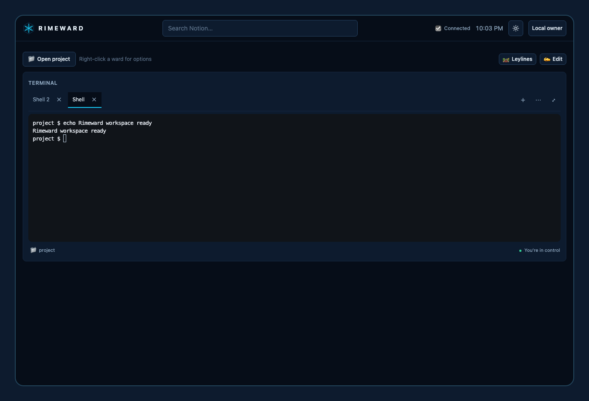
  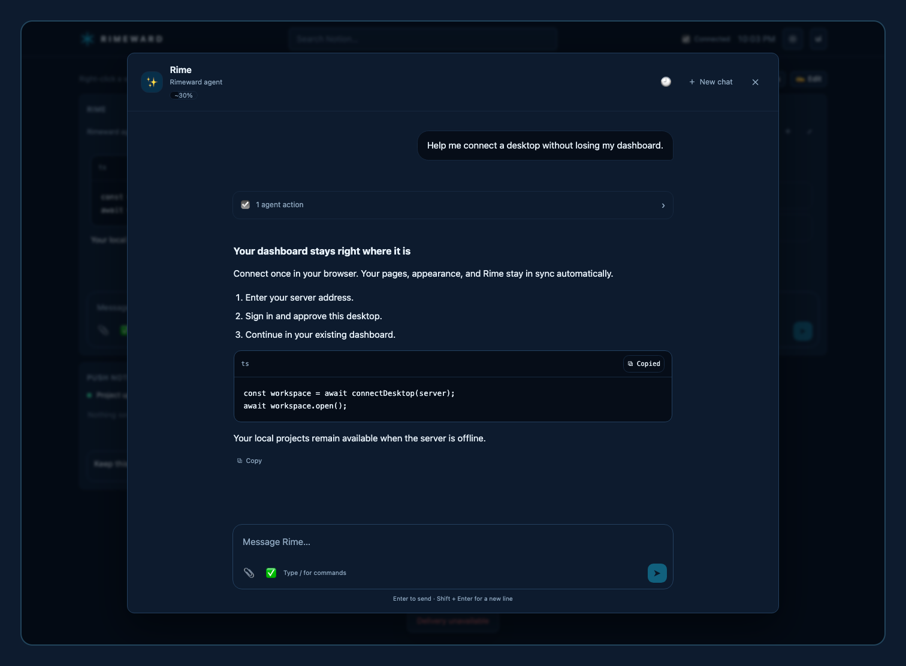
</p>
<p align="center">
  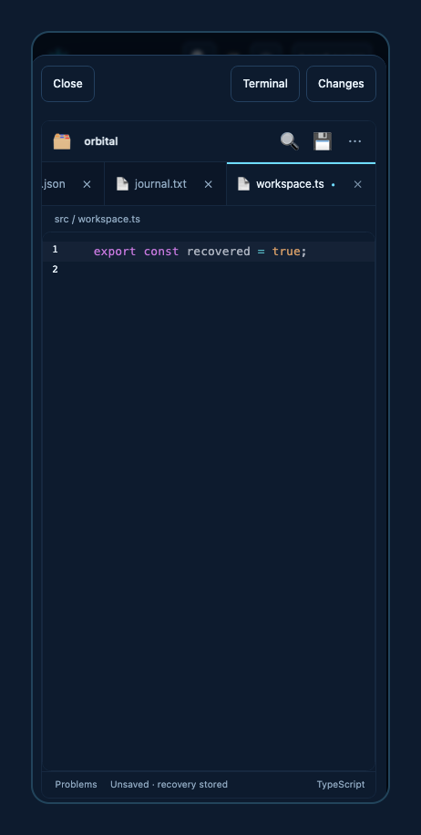
  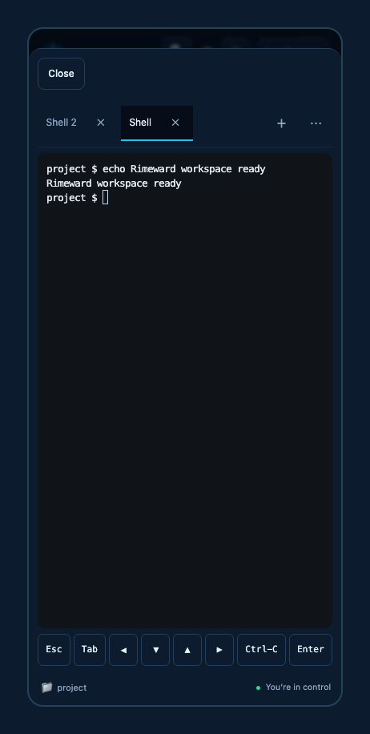
  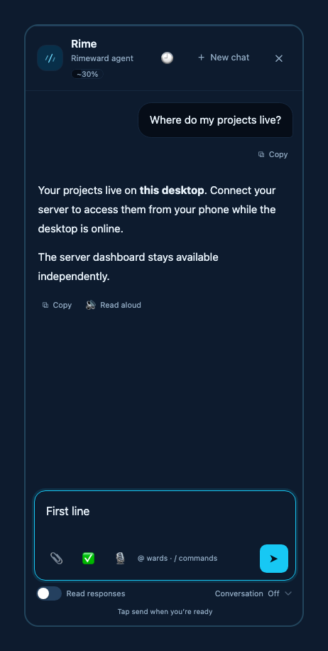
</p>

All interface icons follow the selected icon or emoji pack, style, tint, size, opacity, and
stroke settings. Terminals stream output over a shared connection, preserve Unicode widths,
and recover missed output without replaying input. **Allow Rime to type** takes effect
immediately and remains separate from **Standard / Unrestricted** CLI launch permissions,
which change on the next start. New sessions keep Rime input off. Language servers, cross-file
type checking, debugging, and VS Code extensions remain outside this release. The published
installer link may lag the source; build this checkout for the new workspace experience
until a corresponding desktop release is published.

## Layout

- `src/pages` routes · `src/lib` the server (auth, site, brand, wards, status, logic engine,
  agent, tunnel, browser sessions, comms, device relay and local development runtime) ·
  `src/scripts/app` the dashboard client · `src/styles/frost.css` the token system,
  `development.css` and `conversation.css` the focused workspace surfaces
- `bin/rimeward.mjs` the CLI · `migrations/` numbered SQL, applied on first open
- `desktop/` the Tauri app · `ops/` the nginx example, the seccomp profile, the brand and
  goldens generators

Regenerate the screenshots with `npm run goldens`; the generator uses disposable data and
the browser/UI smoke tests, without personal accounts or model calls. See [Contributing](CONTRIBUTING.md).

## License

[MIT](LICENSE)
