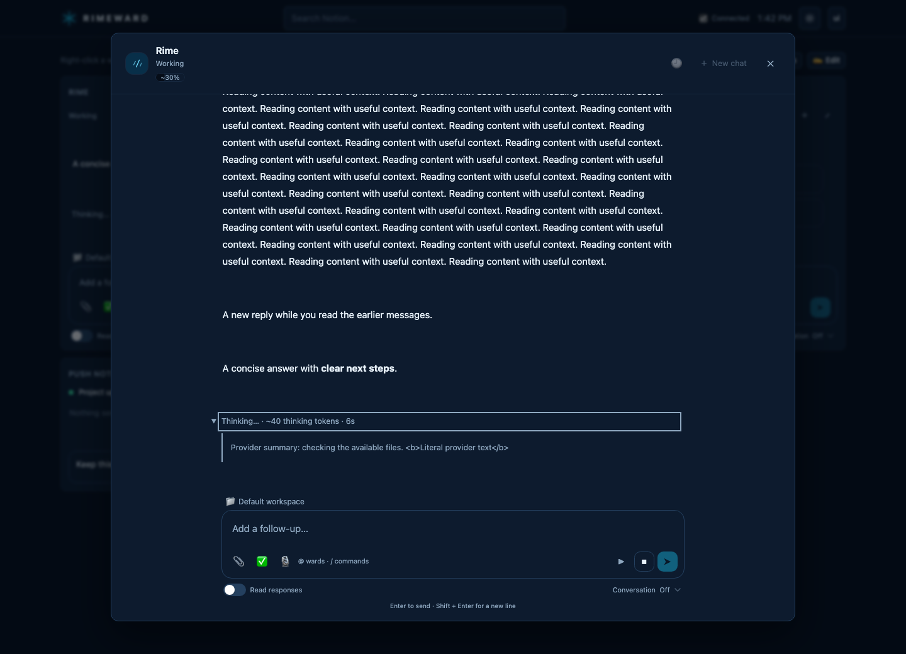

# Agent chat reliability audit

The observed model request waited for 10 minutes 21 seconds before returning. Stop was acknowledged by the local endpoint in about 10 milliseconds, but the turn did not settle until the provider returned. The eventual tool calls were recorded as not run. This establishes a cancellation failure in the model wait, not a blocked approval or an executing browser action; it does not establish the upstream provider's internal cause.

## Changes

- Model calls, compaction, and the server model relay now race completion against cancellation and an independent deadline. Existing budgets remain: 120 seconds for server OpenRouter calls and 330 seconds for other model waits. Late callbacks are suppressed. Accepted streams are not automatically replayed.
- Stream cancellation explicitly cancels the reader, without waiting indefinitely for transport cleanup. Child model slots release on cancellation. The round's controller stays armed during tool execution; completed tool receipts remain authoritative.
- Stop acknowledges the click immediately and bounds the control request to ten seconds. Failure to confirm Stop is shown as an error, not as a successful stop.
- Chat repaint no longer waits for account/file synchronization. A dropped or malformed response stream recovers the stored transcript, retries read-only reconciliation while needed, and does not resend the message. An older request's cleanup cannot clear the next request's controller.
- Progress distinguishes waiting for the model, streamed thinking, and receiving an answer. Thinking shows the provider's token count when available, or a clearly marked four-UTF-8-bytes-per-token estimate from plain reasoning deltas. Encrypted reasoning and summaries are never counted as full reasoning. Providers without counts show their unavailability.
- The Thinking line expands when the provider supplies exposed reasoning or a summary. OpenRouter reasoning and Responses API summaries render as plain text in a keyboard-accessible native disclosure. Expansion survives streaming updates. The live-session display is bounded to 32,000 characters with a truncation notice; it is not a new durable history record. Encrypted reasoning is never displayed, and text is excluded from model-call diagnostics.
- The last 40 model-call records per account retain metadata in `agent_model_calls:<user>`: model, conversation/cache reference, duration, first thinking/text timing, count provenance, and outcome. No prompts or reasoning text are added to these diagnostics.

## Validation

Validation used an isolated copy of HEAD with only this change, excluding concurrent authentication and desktop work.

- Full existing suite: 594 passed. An earlier browser-input timing failure passed on the rerun.
- Final focused agent checks after the last controller-lifetime change: 51 passed.
- Typecheck, application build, and desktop lint passed.
- Ad hoc checks passed for an uncooperative provider, forced timeout, suppression of late output, next-call recovery, blocked SSE cleanup, and estimated/exact reasoning counts without double counting.
- The existing conversation UI smoke fails because its New Chat fixture mocks the retired endpoint. With a temporary in-memory adapter to the current placement endpoint, the complete smoke passed, plus token-label accessibility and immediate Stop feedback. Repository test files were not changed.
- The required remote-workspace smoke did not pass: it timed out waiting for the Add Workspace dialog to close. Remote end-to-end validation remains outstanding.

These are source and isolated-build results. The changes have not been deployed or installed into the running desktop. Native execution that does not support cancellation still requires its own completion receipt; releasing a model wait is not evidence that an external operation was rolled back.

## Preview

