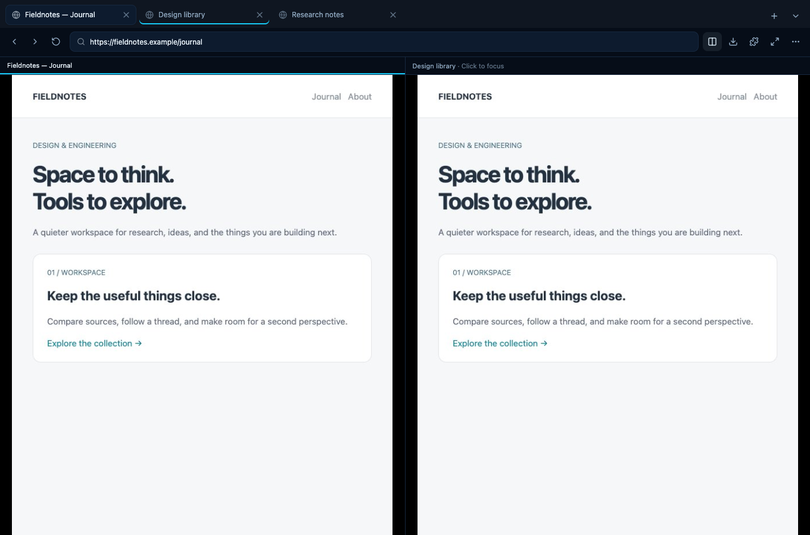

# Browser windows and tabs

The browser uses the same session in its dashboard ward, expanded editor, and
standalone window. Pop-outs fill their window and use the operating system’s
window controls. The browser toolbar’s full-screen button (or F11) enters true
full screen; desktop windows use the native window API.

- Close any tab with its close button or a middle click.
- Drag tabs to reorder them. The tab context menu also offers Move left/right,
  Close, Close others, and Open side by side. Alt+Left/Right on a focused tab
  reorders it without a mouse.
- Search tabs from the chevron beside the new-tab button. Each result has a
  management menu, including for tabs outside the visible strip.
- Side-by-side view keeps two live Chromium streams. Click either pane to
  focus and interact with it. The address bar and agent follow the focused
  pane. Toggle the split button again to return to one page.
- Cmd/Ctrl+L focuses the address bar, Cmd/Ctrl+T opens a tab, Cmd/Ctrl+W closes
  it, Cmd/Ctrl+R reloads, Ctrl+Tab cycles tabs, and Cmd/Ctrl+1–9 selects a tab.
  In an ordinary web browser, some reserved shortcuts may be handled by the
  host browser; the visible controls remain available.
- The address bar accepts URLs or search terms. Search terms open Google.
  Sessions support up to 32 tabs. Tab order follows the existing desktop
  session checkpoint; split presentation lasts for the live session.

Rime’s `browser_tabs` tool lists tabs with stable session IDs and supports
`select`, `new`, `close`, `move`, `split`, and `unsplit`. `browser_snapshot`
also returns tab IDs. Re-read the snapshot after changing the active tab;
accessibility references belong to the page that produced them.

## Pop-out rendering

All ward pop-outs server-render only the selected ward (and its children for
a group). The complete layout JSON remains available for routing and safe
layout reconciliation, but other ward DOM is not created on initial load or
when live layout updates arrive. Dashboard header, page navigation, edit
toolbar, and entrance backdrop are omitted.

Background setup and live theme updates refuse page/header scenes before
allocating canvases or importing the renderer. CSS image and aurora backdrops
are also disabled. Notebook, notepad, agent, and remote-desktop editors fill
their standalone window and rely on the OS close control. Closing a window
retains the existing flush-and-return path to the dashboard.

Split JPEG streams stop with the last viewer and obey transport backpressure.
The focused pane can continue using the existing WebRTC video/audio path;
the second pane uses a separate Chromium screencast. No extra browser context,
profile, or dependency is created for a split.
